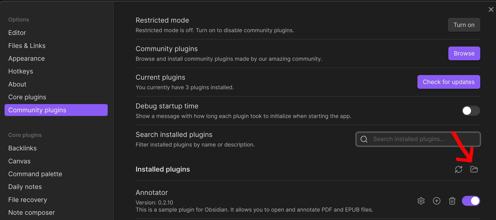

# Why & how to use this fork?

This fork changes the way annotation links are named and presented, so it's easier to treat them as links.
It allows you to do the following:

annotation-target:: example.pdf


```dataview
TABLE WITHOUT ID Links as Links
FLATTEN file.outlinks as Links
WHERE !contains(string(Links), "ANNOTATION:") AND file.name = this.file.name AND !contains(string(Links), "Images/")
GROUP BY Links
```

```dataview
TABLE WITHOUT ID replace(string(links), "ANNOTATION: ", "") as "PDF Links"
FLATTEN file.outlinks as links
WHERE contains(string(links), "ANNOTATION: ") AND file.name = this.file.name
```
  
Copy `example` dir inside any vault to check if everything works. `dataview` plugin is required for the above to work.

You can write your own notes, linking to other stuff if you like: [[example/Very important document]]
## How to download?
Run `download.sh AdiNar obsidian-annotator` inside your community plugins dir.
You can open it here:



>%%
>```annotation-json
>{"text":"Indeed, this line is annotated","target":[{"source":"vault:/example/example.pdf","selector":[{"type":"TextPositionSelector","start":32,"end":46},{"type":"TextQuoteSelector","exact":"I’m annotated.","prefix":"This PDF is just a nice example.","suffix":"I can even use links inside anno"}]}],"created":"2023-10-07T08:39:44.582Z","updated":"2023-10-07T08:39:44.582Z","document":{"title":"Dokument bez tytułu","link":[{"href":"urn:x-pdf:e1393b78a89de2b9416ff7db54af818b"},{"href":"vault:/readme_resources/example.pdf"}],"documentFingerprint":"e1393b78a89de2b9416ff7db54af818b"},"uri":"vault:/readme_resources/example.pdf"}
>```
>%%
>*%%PREFIX%%This PDF is just a nice example.%%HIGHLIGHT%% ==I’m annotated.== %%POSTFIX%%I can even use links inside anno*
>%%LINK%%[[#^67kje7evvsp|ANNOTATION: Indeed, this line is annotated]]
>%%COMMENT%%
>Indeed, this line is annotated
>%%TAGS%%
>
^67kje7evvsp


>%%
>```annotation-json
>{"created":"2023-10-07T08:41:30.559Z","text":"Just to show that multiple links also works :)","updated":"2023-10-07T08:41:30.559Z","document":{"title":"Dokument bez tytułu","link":[{"href":"urn:x-pdf:e1393b78a89de2b9416ff7db54af818b"},{"href":"vault:/example/example.pdf"}],"documentFingerprint":"e1393b78a89de2b9416ff7db54af818b"},"uri":"vault:/readme_resources/example.pdf","target":[{"source":"vault:/readme_resources/example.pdf","selector":[{"type":"TextPositionSelector","start":24,"end":31},{"type":"TextQuoteSelector","exact":"example","prefix":"300%400%This PDF is just a nice ","suffix":".I’m annotated.I can even use li"}]}]}
>```
>%%
>*%%PREFIX%%300%400%This PDF is just a nice%%HIGHLIGHT%% ==example== %%POSTFIX%%.I’m annotated.I can even use li*
>%%LINK%%[[#^y62dd5e9ma|ANNOTATION: Just to show that multiple links also works :)]]
>%%COMMENT%%
>Just to show that multiple links also works :)
>%%TAGS%%
>
^y62dd5e9ma


>%%
>```annotation-json
>{"text":"[[example/That's a link!]]","target":[{"source":"vault:/example/example.pdf","selector":[{"type":"TextPositionSelector","start":61,"end":66},{"type":"TextQuoteSelector","exact":"links","prefix":"le.I’m annotated.I can even use","suffix":"inside annotations that will be"}]}],"created":"2023-10-07T08:42:19.143Z","updated":"2023-10-07T08:42:19.143Z","document":{"title":"Dokument bez tytułu","link":[{"href":"urn:x-pdf:e1393b78a89de2b9416ff7db54af818b"},{"href":"vault:/readme_resources/example.pdf"}],"documentFingerprint":"e1393b78a89de2b9416ff7db54af818b"},"uri":"vault:/readme_resources/example.pdf"}
>```
>%%
>*%%PREFIX%%le.I’m annotated.I can even use%%HIGHLIGHT%% ==links== %%POSTFIX%%inside annotations that will be*
>%%LINK%%[[#^pl6wwrxi3t|ANNOTATION: [[example/That's a link!]]]]
>%%COMMENT%%
>[[example/That's a link!]]
>%%TAGS%%
>
^pl6wwrxi3t
